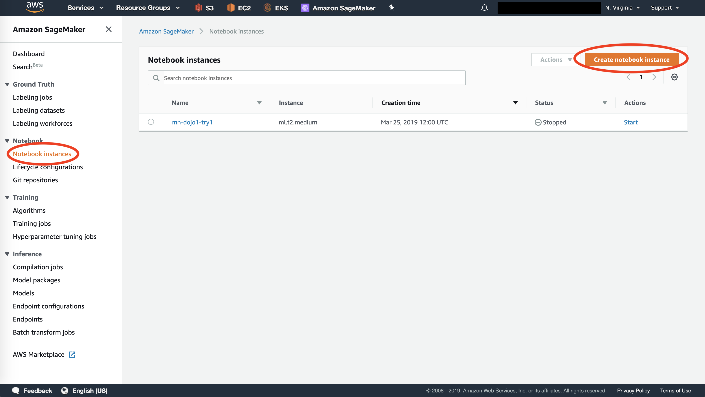
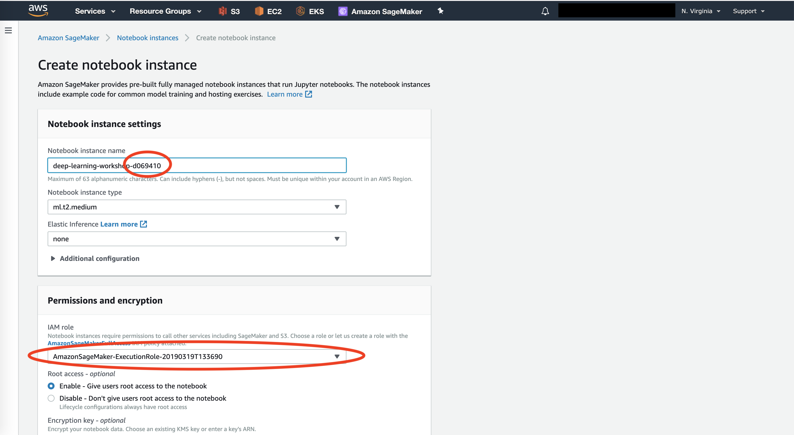
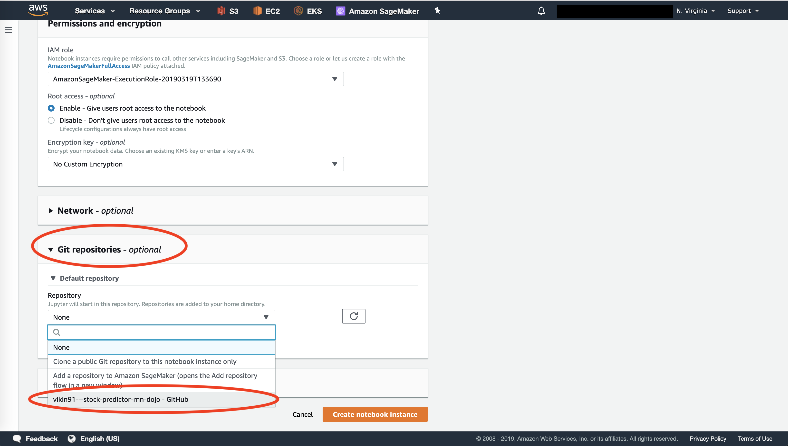
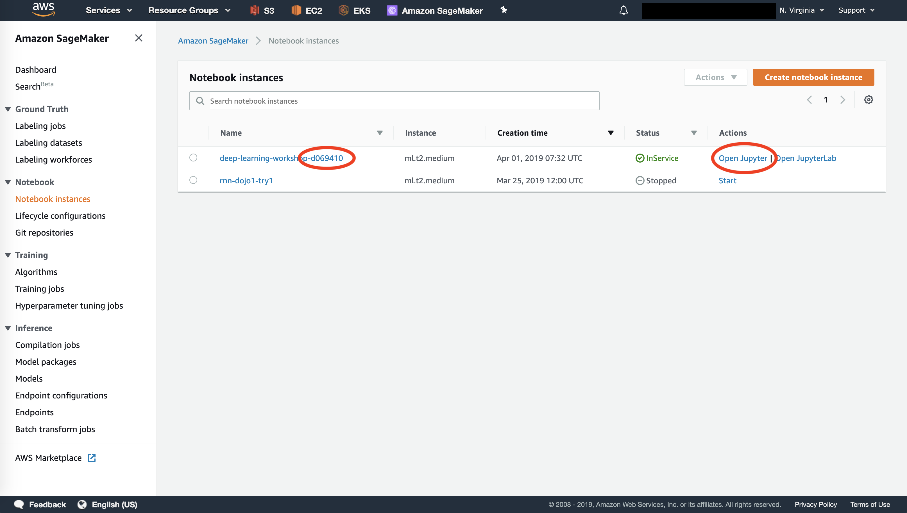

# Stock Predictor - Code Dojo - Deep Learning Workshop #1

## Disclaimer

This repository is intended for educational purposes only.

**Never invest any money based on predictions obtained from this project!**

## Quick Start

### Step 1: Login to AWS

Login to AWS account with credential provided to you over e-mail.
Use Account ID/Alias as provided by the instructor or follow instructions from the e-mail.

### Step 2: Open SageMaker

Under "Services" select "SageMaker" or navigate to: https://console.aws.amazon.com/sagemaker/home?region=us-east-1#/dashboard

### Step 3: Create New Notebook Instance

### Step 4: Name the Notebook

The notebook shall not be shared an thus must have unique name.

### Step 5: Select GitHub Repository with Code

Select Git repo. Use appropriate branch (default: `master`).

### Step 6: Open Jupyter Environment

Click "Open Jupyter" next to your notebook instance.

### Step 7: Open Jupyter Notebook

Open notebook from file `workbook-deep-learning.ipynb`.
Follow the instructions included in the workbook.

## Cleanup

Make sure that AWS resources are deleted after the workshop. In particular this applies to:
- Endpoints (must be deleted)
- Training and Tuning jobs must be interrupted or stopped
- SageMaker Notebook Instances (must be at least stopped)
- Data in S3 (must be deleted)
